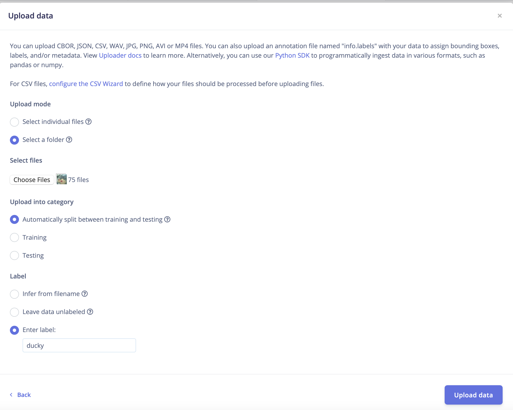

# Day 1: Image Classification with EDGE IMPULSE (Example: Duckie, cherry or tomato?)
In day one we will assemble our material and run a small test on the microcontroller. Afterwards, you will start gathering a dataset of Duckies, cherries and tomatoes and then we will go to edge impulse to create am image classifier and deploy it in your microcontroller.

## Your Microcontroller
We are working with [XIAO-ESP32-S3 Sense from Seeed Studio](https://www.seeedstudio.com/XIAO-ESP32S3-Sense-p-5639.html)

Key specifications of the ESP32-S3:
- Xtensa LX7 **dual-core**, 32-bit processor that operates at up to **240 MHz**
- On-chip 8M PSRAM & 8MB Flash
- additional support for vector instructions - [AI Acceleration Support](https://www.espressif.com/en/products/socs/esp32-s3?form=MG0AV3) - [ESP-NN](https://github.com/espressif/esp-nn)

In order to work with it we will do the following:

### Installing the library

- Open Arduino IDE
- Navigate to "File" > "Preferences", and add to "Additional Boards Manager URLs" this url: https://raw.githubusercontent.com/espressif/arduino-esp32/gh-pages/package_esp32_index.json
- Open the "Boards manager": "Board" Symbol on the left side of the screen OR "Tools" > "Board" > "Boards Manager..."
- Search for "esp32" by Espressif Systems. Install the ESP board - **!Important!** version 2.0.14

### Testing the Microcontroller with the blink example
- Go to File -> Examples -> Basic -> Blink
- Connect your MCU with a USB cable to the Computer, and select in the Arduino IDE the right COM port and the right board-type ("XIAO ESP32S3")
- Upload the code. The built-in LED should start blinking.

## Gathering data
We will use the camera server to gather the samples for our model. 
For this
- "File" > "Examples" > "esp32" > "camera" > "camera webserver"
    - modify the code for the right board (comment and uncomment defines)
    - ssid: given in workshop
    - pass: given in workshop
    - upload
    - open serial monitor
    - copy IP address
- With your code/text editorm open get_images.py and update the IP address in the top of the script (URL variable)
- Open a terminal and navigate to the folder with the .toml file
- Check if you can run rye (type rye)
    - if not cannot, then type `source "$HOME/.rye/env"`. Now you should be able to call rye.
- **make sure your PC/Laptop is connected to the same network as mentioned above**
- run the camera server:
    -type: rye run get_images
- By pressing a digit (0-9) you will save the corresponding image on the root folder under ./data/raw/ in a separate folder ('q' to close the program)
- Recommended: One folder per object
- We recommend taking at least 70 images per object, the object shouldn´t be to small and the image should only include the one object you want to classify. Also put the object onto other backgrounds.

## Training and Deploying the Classifier in Edge Impulse
First you need to log-in in [Edge Impulse Studio](https://studio.edgeimpulse.com/login) and create a new project. (You are limited to 2 private projects in the free version).

- Once you have created a new project you are ready to load the gathered data. For this click on the Add existing data button and then upload data.
- Now you should upload only the images of the first class (e.g. ducky or cherry). It is easier if you already separated the classes per folder. We did that already when gathering the data. Choose the corresponding folder from the file explorer and let it split automaticaylly between training and testing (This will do an 80% training and 20% Testing by default). Finally enter the label of the corresponding class explicitly and click on upload data.
{height=100}

- Create your Model as explained in the Hands-On
- Deploy your Model

## Running inferences

### Test the model
- Add the zip library to Arduino ("Sketch" > "Include Library" > "Add .ZIP library")
- Open "File" > "Examples" > name of your library > "static buffer" > "static buffer"
- Modify the features[] with features data from Edge Impulse

### Running live inferences
- Open "File" > "Examples" > name of your library > "esp32" > "esp32_camera"
- Update the pins of the Microcontroller, delete lines XXX to XXX and paste in:
```
#define PWDN_GPIO_NUM     -1
#define RESET_GPIO_NUM    -1
#define XCLK_GPIO_NUM     10
#define SIOD_GPIO_NUM     40
#define SIOC_GPIO_NUM     39


#define Y9_GPIO_NUM       48
#define Y8_GPIO_NUM       11
#define Y7_GPIO_NUM       12
#define Y6_GPIO_NUM       14
#define Y5_GPIO_NUM       16
#define Y4_GPIO_NUM       18
#define Y3_GPIO_NUM       17
#define Y2_GPIO_NUM       15
#define VSYNC_GPIO_NUM    38
#define HREF_GPIO_NUM     47
#define PCLK_GPIO_NUM     13
```
- Activate the PSRAM when uploading
- Open the Serial Monitor to see the output

[Go to day 2](../day_2/README.md)
